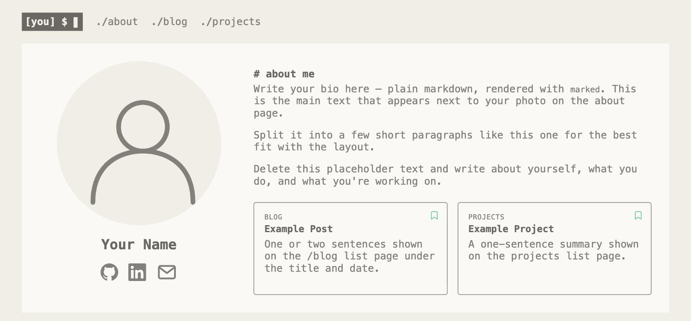

# Birch
 

A minimalist, responsive static-site template inspired by terminal ricing aesthetics.

Birch renders an about page, a blog, and a projects page from markdown content to plain HTML — no server, no client framework, just Node at build time and GitHub Pages after.

It started as the source for [vtaylor.dev](https://vtaylor.dev), then got stripped down into a reusable template anyone can fork and re-skin.

**[Live demo →](https://toadsta.github.io/birch/)**



## Recommended Setup

1. Fork this repository.
2. Enable Actions: forks have GitHub Actions disabled by default. Go to the **Actions** tab and click "I understand my workflows, go ahead and enable them."
3. Enable Pages: go to Settings → Pages and set the source to **GitHub Actions**. This is a repo setting, not a file, so it never carries over from a fork.
4. Edit `content/settings.md` with your name, socials, and bio — that's the only file you need to touch to make this yours.
5. Push to `main`. The "Deploy to GitHub Pages" workflow builds and deploys automatically from here on.

Want to preview or edit locally before pushing? See Local Development below.

## Local Development

1. Clone this repository.
2. Install dependencies:
```npm install```
3. Build the static site:
```npm run build```
This renders everything into `dist/` — the same output GitHub Pages deploys. Open `dist/index.html` directly, or serve it with `npx serve dist` for working relative links.

## Making it yours

- **Settings**: `content/settings.md` is the single place for everything — name, nav tagline, photo, socials, custom domain, and your bio (the markdown body below the frontmatter). Every page reads it; comments explain each field.
- **Content**: `content/blog/` and `content/projects/` hold your posts and projects — see "Adding a blog post or project" below.
- **Favicon**: `public/images/favicon-*.png` and `apple-touch-icon*.png` are a generic `>_` mark — swap them for your own if you want.

## Adding a blog post or project

Drop a markdown file with frontmatter into `content/blog/` or `content/projects/` — the filename (minus `.md`) becomes the URL slug. `content/blog/example-post.md` and `content/projects/example-project.md` are live examples with every frontmatter field explained inline — copy one and rename it, or edit it into your first real post/project.

<details>
<summary>Project Structure</summary>

```
├── build.js                 # static export to dist/ for GitHub Pages
├── lib
│   ├── content.js           # loads markdown content (gray-matter + marked)
│   └── errors.js
├── content
│   ├── settings.md
│   ├── blog
│   └── projects
├── views
│   ├── base.ejs
│   ├── about.ejs
│   ├── blog.ejs
│   ├── blog-post.ejs
│   ├── projects.ejs
│   ├── project-detail.ejs
│   └── error.ejs
└── public
    ├── css
    ├── fonts
    ├── images
    └── javascript
```

</details>

## License

MIT — see [LICENSE](LICENSE.md).

## Acknowledgments

Originally built by Victoria Taylor ([@Toadsta](https://github.com/Toadsta)) as the personal site vtaylor.dev, then extracted into this template. The theme is inspired by [Risotto](https://github.com/joeroe/risotto) for Hugo, and error pages use cat images from [http.cat](https://http.cat).
